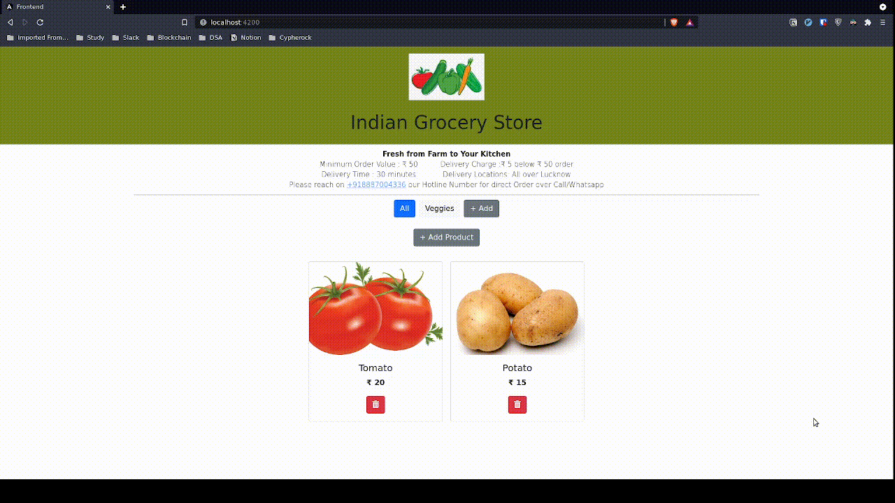
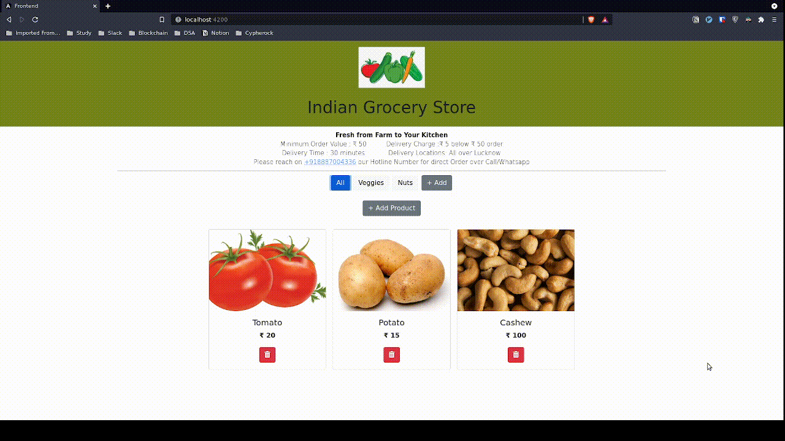

# Alityart-Task

## Setup

- Clone the repository
- Install yarn `npm i -g yarn`
- Go to backend dir
  ```
  cd backend
  ```
- Duplicate the `.env.example` file to `.env` and add you MySQL configurations
- Create the schema manually in MySQL
- Create all the tables by this command
  ```
  npx sequelize-cli db:migrate
  ```
- Run backend
  ```
  cd backend
  yarn
  yarn dev
  ```
- Run the frontend in another terminal
  ```
  cd frontend
  yarn
  yarn start
  ```
- Open `http://localhost:4200` in browser

## Demo

### Create Category and product



### Delete Category and product


